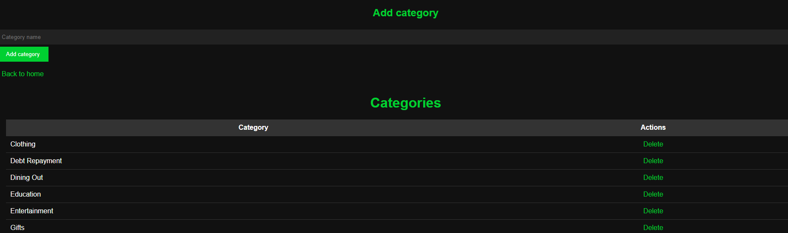
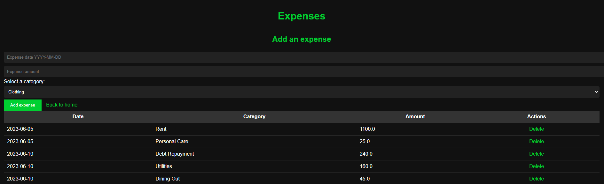

# Project overview

A simple flask app where the user can input expenses and track how much money they are using monthly.

The project was done with the intend of learning Flask.

# Setting up MySql

1. Download XAMPP from https://www.apachefriends.org/download.html
2. Start the Apache and MySQL server

3. Go to localhost and click **phpMyAdmin**
4. Create a new database by click **new** on the left panel. In this project it is called "flask_mysql_db"

5. Create a categories table and a expenses table to the created db. This is done by selecting the db from the left panel and choosing SQL from the top panel. The MySQL command for these can be found from sql/create_category_table.sql. Copy it to the field and click "Go".


# Using the app

## Running the app

1. Clone the repo.
2. Activate the virtual environment by ```.\env\Scripts\activate.bat```
3. Run the app with ```python app.py```
4. Open a browser and go to http://127.0.0.1:5000 (default)

## Adding categories

1. Before adding expenses the user needs to add categories. The categories can be added one by one from the app itself or use mysql statements straight from the mysql server.
2. Navigate to http://127.0.0.1:5000/view_categories and write a category name and click "Add category". This will add the category to the categories table.

3. The user can delete categories by clicking the Delete button.

NOTE: the category names are unique. If a duplicate entry is given the app will throw an error.

## Adding expenses

1. Navigate to http://127.0.0.1:5000/view_expenses
2. Enter the expense date in given format (JS is used to validate the format)
3. Enter the amount
4. Select the category and click "Add expense"

