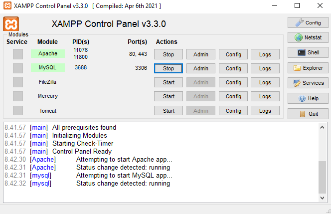

# Project overview

WIP. The goal is to create a Flask App where the user can input and track their expenses.

# Setting up MySql

1. Download XAMPP from https://www.apachefriends.org/download.html
2. Start the Apache and MySQL server

3. Go to localhost and click **phpMyAdmin**
4. Create a new database by click **new** on the left panel. In this project it is called "flask_mysql_db"

5. Create a categories table to the created db. This is done by selecting the db from the left panel and choosing SQL from the top panel. The MySQL command for this can be found from sql/create_category_table.sql. Copy it to the field and click "Go".

